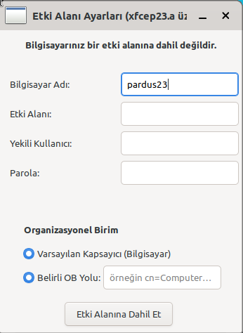
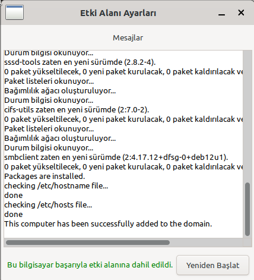
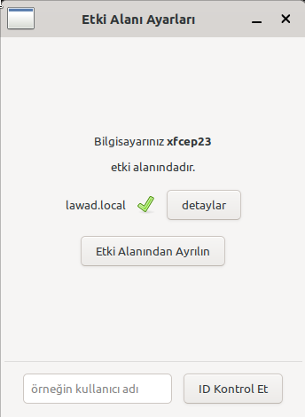
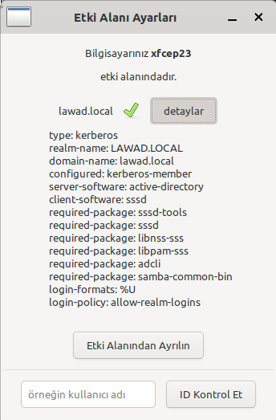
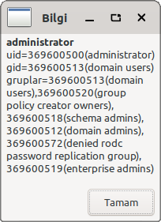

## Domain Joiner

Domain Joiner is GUI app that joins users to the domain.

### Dependencies

This application is developed based on Python3 and GTK+ 3.

`python3-gi, gir1.2-glib-2.0, gir1.2-gtk-3.0, gir1.2-vte-2.91, python3-apt`

### Screenshots

