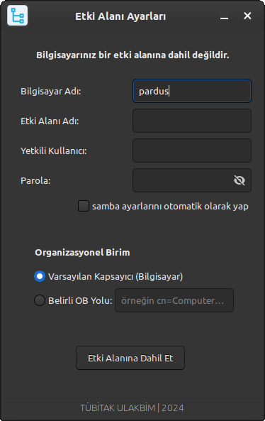
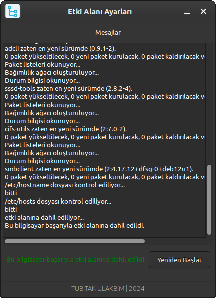
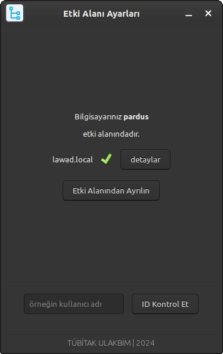
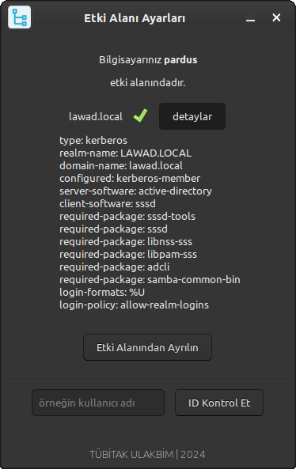
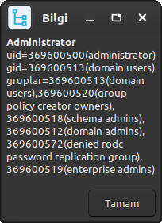
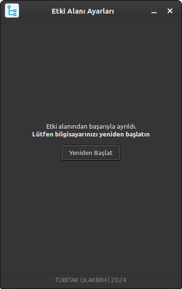

# Domain Joiner

**Domain Joiner** is a graphical user interface (GUI) application developed in Python3 and GTK+ 3. It facilitates the process of joining users to a domain or removing users from the domain.

## Dependencies

Make sure to install the following dependencies before running the application:

- `python3-gi`
- `gir1.2-glib-2.0`
- `gir1.2-gtk-3.0`
- `gir1.2-vte-2.91`
- `python3-apt`
- `realmd`
- `krb5-user`
- `samba`
- `sssd`
- `libsss-sudo`
- `packagekit`
- `adcli`
- `sssd-tools`
- `cifs-utils`
- `smbclient`

## Installation

1. Install the required packages using your package manager.

2. Clone the repository:

   ```bash
   git clone https://git.pardus.net.tr/busra.cagliyan/domain-joiner
   ```

3. Run the program:
    
    * GUI 
      ```bash
      sudo python MainWindow.py
      ```
    
    * CLI
      ```bash
      sudo python DomainJoinerCLI.py -h
      ```
    
## Screenshots

**Domain Join Page**



This screen displays the steps required to join your computer to a domain.

**Error Message Page**



This screen appears while joining the domain and contains an error message if an error is encountered.

**Domain Information Pages**




These screen appears information about the domain if successfully join the domain

**User Information Page**



This screen displays user information.

**Leave Domain Page**



This screen appears when the computer leaves the domain, prompting you to restart the computer.

