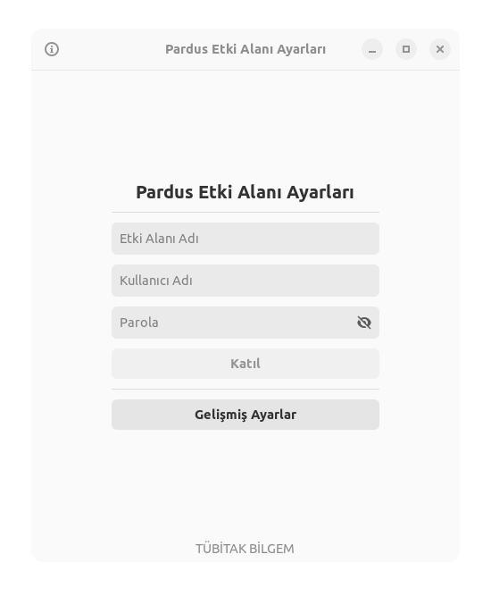
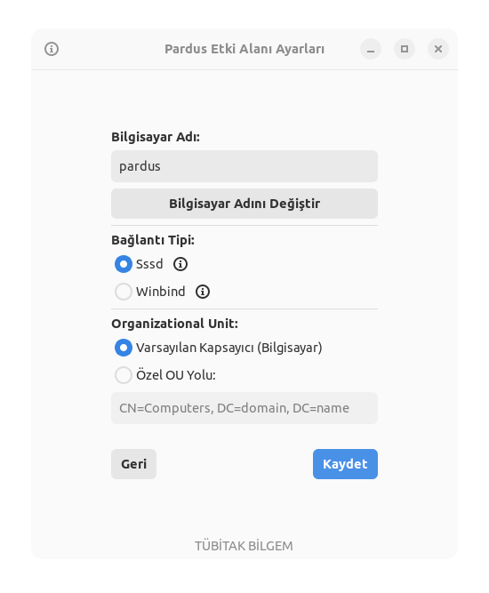
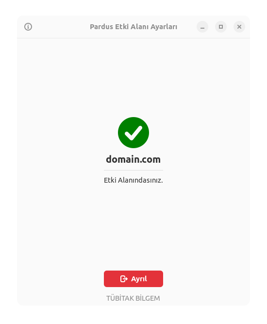

# Pardus Domain Joiner

**Pardus Domain Joiner** is a graphical user interface (GUI) application developed in Python3 and GTK+ 3. It facilitates the process of joining users to a domain or removing users from the domain.
    

